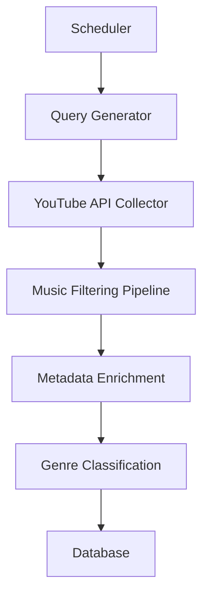
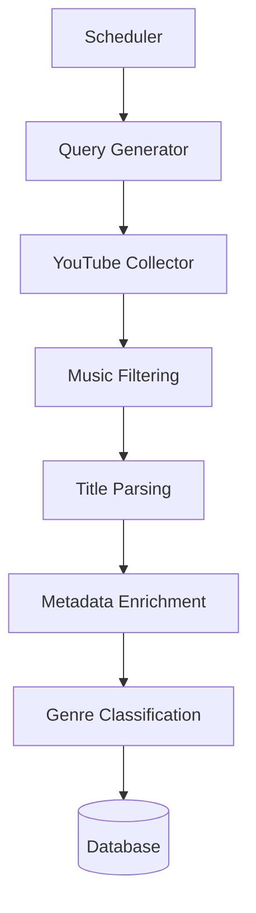

# 🎧 YouTube Music Collection Architecture

## Overview
이 시스템은 YouTube에서 음악 데이터를 자동으로 수집하여 추천 시스템에 사용할 대규모 음악 데이터셋을 구축합니다.

### 목표
- **100,000 songs dataset** 확보
- **Collection period**: 30 days
- **Balanced genre distribution** (장르별 균형 있는 데이터)

### 사용 API
- **YouTube Data API**
- **MusicBrainz**
- **Last.fm**

---

## 1️⃣ 전체 아키텍처

### 데이터 수집 시스템 구조

### 설명
- **Scheduler**: 수집 작업 자동 실행
- **Query Generator**: 장르별 검색 쿼리 생성
- **YouTube Collector**: 영상 데이터 수집
- **Filtering Pipeline**: 음악 영상만 필터링
- **Metadata Enrichment**: 음악 메타데이터 보강
- **Genre Classification**: 장르 자동 분류
- **Database**: ️최종 저장 공간

---

## 2️⃣ 목표 데이터 전략

### 목표 데이터셋
- 총 **100,000 songs**

### 장르 균형 전략
추천 시스템이 특정 장르에 치우치지 않도록 다음과 같이 장르별 목표치를 설정합니다.

| Genre | Target |
|---|---|
| **Pop** | 20,000 |
| **Rock** | 15,000 |
| **Hip-hop** | 15,000 |
| **K-Pop** | 10,000 |
| **Jazz** | 10,000 |
| **Lo-fi** | 10,000 |
| **Indie** | 10,000 |
| **Electronic** | 10,000 |

---

## 3️⃣ Query Generation Strategy
YouTube 검색 쿼리는 철저히 장르 기반으로 생성합니다.

### 쿼리 예시
- `pop music` / `rock music` / `hip hop music` / `kpop music` / `jazz music` / `lofi music` / `indie music` / `electronic music`

### 확장 쿼리
- `pop official music video`
- `pop song`
- `pop playlist`
- `new pop music`

### Query Pool 예시 (총 ~200 Queries)
- `pop music`, `pop song`, `pop official video`
- `rock music`, `rock band`
- `indie music`, `indie band`
- `jazz piano`
- `lofi study music`, `lofi chill beats`

---

## 4️⃣ Daily Collection Strategy
30일 동안 수집을 진행하여 100,000곡의 목표를 달성하기 위한 구체적인 수치입니다.

- **하루 목표**: 약 **3,300 songs**
- **YouTube API 검색 방식**: 1 Search 당 50 Videos 조회
- **필요 검색 수**: 3,300 / 50 ≈ 66 Searches
- **하루 수행 분량**: 넉넉하게 **70 Searches / Day**로 설정

---

## 5️⃣ Genre-balanced Collection
장르 균형을 유지하기 위해 **Genre Queue 시스템**을 도입합니다. Scheduler가 큐 순서대로 쿼리를 실행합니다.

- **Queue 예시**: `pop queue`, `rock queue`, `hiphop queue`, `jazz queue`
- **Scheduler 실행 순서**: `pop` → `rock` → `hiphop` → `jazz` → `lofi`
- **실행 쿼리 예시**: `pop music` → `rock music` → `hip hop music` → `jazz piano` → `lofi beats`

---

## 6️⃣ Quota Management
YouTube Data API의 제한된 할당량(Quota)을 관리하여 안전하게 수집합니다.

- **일일 할당량**: 10,000 Units / Day
- **Search API 호출 비용**: 100 Units / 1 Search
- **하루 최대 검색 가능 횟수**: 100 Searches 가능
- **우리 전략**: **70 Searches / Day** (안전 범위 내 작동)

---

## 7️⃣ Music Filtering Pipeline
YouTube 검색 결과에는 음악이 아닌 영상들이 많이 포함될 수 있으므로, 엄격한 필터링이 필수적입니다.

### 1) Duration Filter
- `duration > 15 minutes` → **제거** (단일 곡이 아닐 확률이 높음)

### 2) Keyword Filter (차단 키워드)
제목 등에 다음 키워드가 포함될 경우 필터링합니다:
`reaction`, `cover`, `karaoke`, `fan cam`, `dance practice`, `tutorial`, `playlist`, `mix`

### 3) Category Filter
- **조건**: YouTube Category ID **10 (Music)** 에 해당하는 영상만 수집합니다.

---

## 8️⃣ Duplicate Detection
중복되는 동영상을 제거하여 데이터 품질을 높입니다.

- **방법 1**: DB 테이블의 `youtube_id` 컬럼에 Unique Index 적용
- **방법 2**: `title + artist`의 혼합 Hash 값으로 중복 여부 확인

---

## 9️⃣ Metadata Enrichment
YouTube 자체 데이터만으로는 음악 정보가 부족하므로, 외부 Meta API를 조회하여 보강합니다.

### 사용 API
- **MusicBrainz**
- **Last.fm**

### 추가할 메타데이터 항목
- Genre (세부 장르)
- Album (수록 앨범 정보)
- Release Date (발매일)
- Tags (관련 태그)
- Similar Artists (유사 아티스트 발굴용)

---

## 🔟 Genre Classification
외부 API 조회가 실패하거나 장르 정보가 없는 경우 자체적으로 자동 분류를 수행합니다.

### 1) Rule-based Classification
제목 및 태그, 채널명 등을 활용하여 분류.
- _예: `lofi`, `jazz`, `piano`, `hip hop`_

### 2) Artist Mapping
아티스트명을 직접 맵핑하여 분류.
- _예: `IU` → K-pop, `Drake` → Hip-hop, `Coldplay` → Rock_

### 3) ML Classifier (Future Plan)
- **사용 모델**: TF-IDF + Logistic Regression 활용하여 정확도 향상

---

## 11️⃣ Scheduler
모든 수집 작업은 자동 실행되도록 설정합니다.

- **실행 방식**: Cron Job
- **실행 주기 예시**:
  - 매일 새벽 시간대 시작 (`02:00 AM`)
  - 혹은 매 시간(Every Hour) 잘게 나누어 분산 실행

---

## 12️⃣ 최종 데이터 흐름 (Pipeline Sequence)

---

## 🚀 Expected Result
- 30일 후 **최종 100,000 songs dataset** 확보 완료
- 장르 간 **Balanced Distribution** 달성
- 순도 높은 **Clean Music Data**
- 최종적으로 **Context-based Music Recommendation System**을 위한 핵심 자산이 됨

---

## 💡 Practical Tip (실전 문제 해결)
YouTube 수집 시스템 구축 시 가장 큰 허들은 다음과 같은 영상들입니다:
> `playlist video`, `mix video`, `1 hour music` 

이러한 영상들이 전체 수집 데이터의 **40% 이상 차지**할 수 있습니다.
따라서 실제 서비스화 단계에서는 **`duration < 10 minutes`** 와 같은 강력한 길이 필터링을 필수적으로 두는 것을 권장합니다.